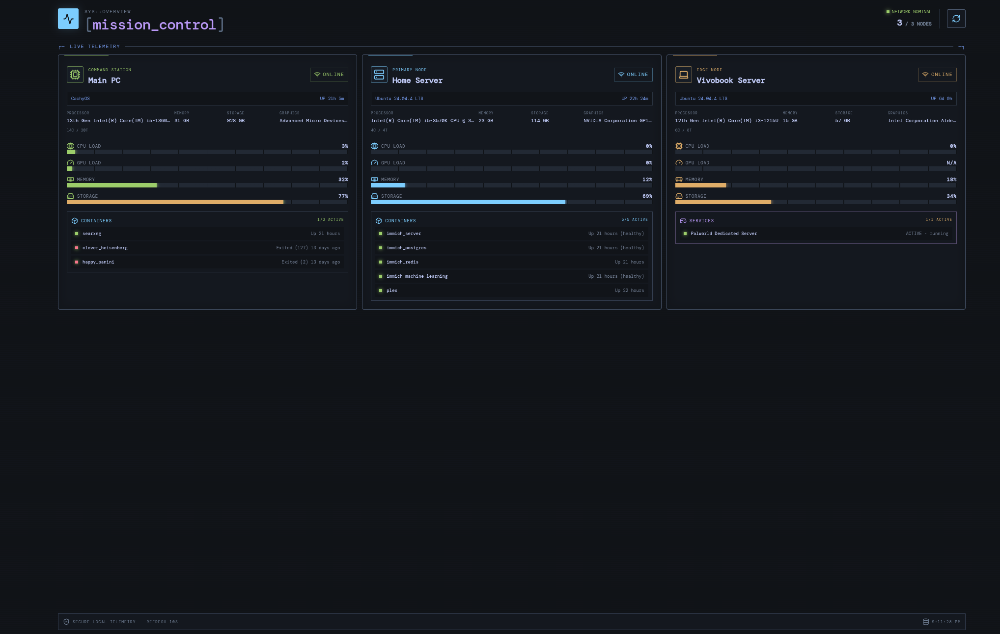

# Mission Control

Mission Control is a self-hosted, btop-inspired dashboard for monitoring computers and servers from one responsive web interface. It reports live hardware details, resource utilization, uptime, Docker containers, and selected systemd services across local or private-network machines.

The project is designed for a trusted LAN or encrypted overlay network such as Tailscale. It does not require a cloud account or external database.

## Features

- Responsive device grid that automatically fills the available screen
- CPU, GPU, memory, and primary-storage utilization meters
- CPU, GPU, memory, storage, operating-system, and uptime details
- Expandable per-device drive inventory with mount, usage, and optional SMART health
- AMD GPU utilization through Linux sysfs and NVIDIA utilization through `nvidia-smi`
- Docker container health, state, and uptime
- Configurable systemd service monitoring, including game servers
- Online/offline detection with a ten-second automatic refresh
- Manual refresh without restarting any monitored service
- Lightweight Python telemetry agent with no third-party Python packages
- Node.js development server and standalone Python production host
- Private remote access through Tailscale IPs or MagicDNS

## Screenshots



The dashboard automatically adapts its btop-inspired system panels to the available screen width.

## Architecture

```text
Browser
  └── Dashboard host (:8080 production or :5173 development)
        ├── Main PC telemetry agent (:4242 or :4243)
        ├── Home Server telemetry agent (:4242)
        └── Additional telemetry agents (:4242)
              ├── /proc and /sys hardware metrics
              ├── Docker CLI
              └── systemctl
```

Each monitored Linux machine runs `agent/telemetry_agent.py`. The dashboard host reads a private device configuration, requests `/api/agent/stats` from every endpoint, and serves the combined result to the React frontend. Remote endpoints should be reachable only through a trusted LAN, VPN, or tailnet.

## Requirements

### Dashboard development

- Node.js 20 or newer
- npm

### Production dashboard host

- Python 3.9 or newer
- A Linux user with a working systemd user session

### Telemetry agents

- Linux with Python 3.9 or newer
- `systemctl` for service monitoring
- Docker CLI and Docker-socket permission for container monitoring
- Optional: `lspci` for GPU identification
- Optional: `nvidia-smi` for NVIDIA GPU utilization
- Optional: `smartctl` from smartmontools for drive-health reporting

Windows is supported by the Node/systeminformation endpoint but not by the lightweight Python agent or included systemd units.

## Development installation

```bash
git clone https://github.com/SaiAnumula/homelab-mission-control.git
cd mission-control
npm install
cp devices.example.json devices.json
npm run dev
```

Open `http://localhost:5173`. Vite serves the frontend and proxies `/api` to the Node telemetry server on port 4242.

Build the frontend with:

```bash
npm run build
```

## Device configuration

`devices.json` is the local runtime configuration and is intentionally ignored by Git. Start from the safe template:

```bash
cp devices.example.json devices.json
```

Each device supports:

| Field | Purpose |
| --- | --- |
| `id` | Stable unique identifier |
| `name` | Display name |
| `label` | Small role label shown above the name |
| `type` | Icon type: `pc`, `server`, or `laptop` |
| `endpoint` | `local` for the Node host, or the telemetry agent URL |
| `accent` | Card color: `green`, `cyan`, or `amber` |

Example remote endpoint:

```json
{
  "id": "nas",
  "name": "Storage Server",
  "label": "STORAGE NODE",
  "type": "server",
  "endpoint": "http://100.64.0.10:4242",
  "accent": "cyan"
}
```

The addresses in example files are documentation-only Tailscale CGNAT examples. Replace them in your ignored runtime configuration.

Set a different Node configuration path with `MISSION_CONTROL_DEVICES=/path/to/devices.json`.

## Telemetry-agent setup

Copy these files to the monitored Linux machine:

- `agent/telemetry_agent.py` → `~/.local/share/mission-control/telemetry_agent.py`
- `agent/mission-control-agent.service` → `~/.config/systemd/user/mission-control-agent.service`

Then enable the service:

```bash
chmod 755 ~/.local/share/mission-control/telemetry_agent.py
systemctl --user daemon-reload
systemctl --user enable --now mission-control-agent.service
sudo loginctl enable-linger "$USER"
```

The agent listens on `0.0.0.0:4242` by default. Override it in the unit with:

```ini
Environment=MISSION_CONTROL_PORT=4243
```

Some PCI identifiers cover multiple closely related GPU models. Set an exact display name when automatic identification is ambiguous:

```ini
Environment="MISSION_CONTROL_GPU_NAME=Radeon RX 9070"
```

Verify it locally:

```bash
curl http://127.0.0.1:4242/api/agent/stats
```

## Production dashboard service

Build the frontend, then place the following under `~/.local/share/mission-control-dashboard/` on the always-on host:

- `dist/`
- `deploy/dashboard_server.py`
- A private `devices.json` copied from `deploy/devices.server.example.json`

Install `deploy/mission-control-dashboard.service` under `~/.config/systemd/user/`, then run:

```bash
systemctl --user daemon-reload
systemctl --user enable --now mission-control-dashboard.service
sudo loginctl enable-linger "$USER"
```

The production dashboard listens on port 8080. Set `MISSION_CONTROL_DASHBOARD_PORT` in the service to choose another port. Set `MISSION_CONTROL_DEVICES` to use a configuration outside the application directory.

## Docker monitoring

The agent runs `docker ps -a` as its service user. Add that user to the Docker group if required:

```bash
sudo usermod -aG docker "$USER"
```

Log out and back in, or restart the user manager, so the new group is applied. Membership in the Docker group is effectively root-equivalent; grant it only to trusted users. Machines without Docker return an empty container list.

## Systemd service monitoring

The agent checks installed services listed by `MISSION_CONTROL_SERVICES`. The current default checks `palworld.service` and omits it when it is not installed. Configure one or more comma-separated units in the agent service:

```ini
Environment=MISSION_CONTROL_SERVICES=palworld.service,minecraft.service
```

After editing the unit:

```bash
systemctl --user daemon-reload
systemctl --user restart mission-control-agent.service
```

Monitoring is read-only. Mission Control does not start, stop, or restart the reported services.

## Storage and drive health

The primary storage meter follows the physical disk containing `/`. Select the storage row on a device card to expand any additional physical drives. Virtual devices such as loop and zram disks are omitted; unmounted physical disks are listed with usage marked unavailable.

Drive capacities use decimal units, matching manufacturer labels such as 2 TB. Memory capacity is normalized to common installed-RAM sizes while utilization continues to use Linux's actual usable-memory value.

SMART health is an optional enhancement; drive inventory, capacity, and utilization work without it. When `smartctl` is installed and readable by the telemetry-agent user, Mission Control reports the device's overall SMART result. Otherwise the dashboard displays `SMART N/A`.

Health probes run concurrently across all physical disks and each one is capped by a timeout, so a drive that stops responding cannot stall the whole stats round or take the node offline. A drive whose SMART result cannot be read reports `SMART N/A` -- the dashboard only shows failing or warning when the drive itself reports it.

Install the optional tool with the package manager for the monitored host, for example:

```bash
# Debian or Ubuntu
sudo apt install smartmontools

# Arch Linux
sudo pacman -S smartmontools
```

After installation, verify access as the same user that runs the telemetry agent:

```bash
smartctl -H -j /dev/sda
```

Some systems restrict physical-drive diagnostics to root even when `smartctl` is installed. Do not grant the agent unrestricted sudo access merely to obtain SMART data. If health reporting is required, use narrowly scoped device permissions or an administrator-reviewed rule appropriate for that host; Mission Control intentionally treats inaccessible health data as optional.

For a dedicated Linux host, the agent can optionally invoke `smartctl` through non-interactive sudo by setting:

```ini
Environment=MISSION_CONTROL_SMARTCTL_SUDO=1
```

This setting does not grant access by itself. An administrator must separately approve exact read-only commands for the specific drives being monitored. For example, `/etc/sudoers.d/mission-control-smart` could contain:

```sudoers
mission-control-user ALL=(root) NOPASSWD: /usr/sbin/smartctl -H -j /dev/sda, /usr/sbin/smartctl -H -j /dev/sdb
```

Replace the username and device paths for the host, validate the file with `visudo`, and do not use wildcards or grant general `smartctl`, shell, or sudo access.

## Tailscale usage

Install Tailscale on the dashboard host, monitored machines, and client devices. Use a Tailscale address or MagicDNS name as each endpoint, then open the production dashboard from another tailnet device:

```text
http://dashboard-host.example.ts.net:8080
```

If UFW is enabled, permit only the Tailscale interface:

```bash
sudo ufw allow in on tailscale0 to any port 8080 proto tcp
sudo ufw allow in on tailscale0 to any port 4242 proto tcp
```

Do not create router port-forwards for these ports. Use Tailscale grants or ACLs to restrict which tailnet identities may reach dashboard and agent ports.

## Security considerations

- The dashboard and telemetry agent currently have no application-level authentication.
- Bind them only to trusted networks, preferably an access-controlled tailnet.
- Never expose ports 4242, 4243, or 8080 directly to the public internet.
- Keep real device configuration out of Git; the repository ignores both runtime JSON files.
- Do not put auth keys, API tokens, passwords, or reusable Tailscale credentials in device configuration.
- Telemetry reveals host hardware, utilization, service names, and container names. Treat it as private operational data.
- Docker-group membership grants powerful host access. Use a dedicated, trusted service user when possible.
- Review example configuration and screenshots for identifiers before publishing changes.

## Tech stack

- React 19
- Vite 8
- Express 5 and `systeminformation` for development/local Node telemetry
- Python standard library for production hosting and Linux telemetry
- Lucide React icons
- systemd user services
- Tailscale for private networking

## License

Mission Control is available under the [MIT License](LICENSE).
